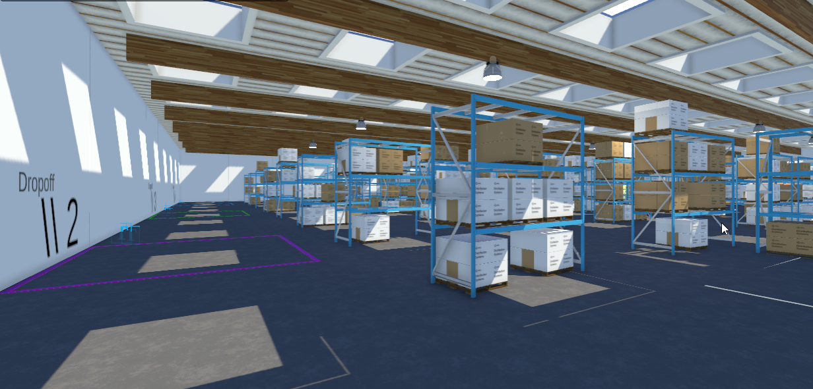

# Research Project '22-'23: AI & Robotics
## FUS-RO-DAH: Functional, Utility Service RObots for Depot Arrangement Handling

Teams are provided a Unity simulation environment.
The environment can be used with *ROS2*, using [this Docker container](https://github.com/PXLRoboticsLab/ROS2_Unity).
All necessary info will be shared here. The document will be updated regularly, so it is recommended to check it every now and then.

 

## Documentation
For all information, check the [Wiki](https://github.com/PXLAIRobotics/researchproject-2223/wiki) pages.
